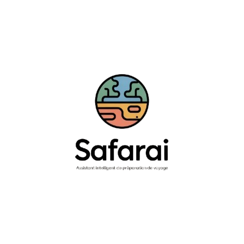

<div align="center">
  
  <h1>SafarAI</h1>
  <p><strong>Your Intelligent Moroccan Travel Concierge</strong></p>
</div>

SafarAI is a modern, AI-powered travel assistant web application specifically tailored for discovering and planning trips across Morocco. From discovering hidden gems to generating contextual itineraries, SafarAI ensures your Moroccan adventure is effortless, inspiring, and culturally enriching.

## ✨ Features

- **Moroccan Persona Chatbot**: An AI concierge powered by Groq (Llama 3.3 70B) that acts as a local expert. It understands context, classifies intent, and provides culturally rich responses in English, French, and Darija.
- **2-Step Waterfall Architecture**: A highly reliable AI orchestration pipeline that decouples intent classification from final response generation, eliminating AI hallucinations and formatting errors.
- **Real-Time Landmark Discovery**: Seamless integration with the OpenTripMap API to fetch real historical, cultural, and natural sites near any Moroccan destination.
- **Dynamic City Resolution**: Built-in coordinate mapping for over 35+ Moroccan cities and regions, allowing the AI to instantly ground its knowledge in precise geographic locations.
- **Smart Trip Planning**: Build a timeline-based itinerary with intuitive drag-and-drop activity planning.
- **Live Weather Context**: Contextual weather widgets seamlessly integrated into the dashboard, packing list, and destination details.

## 🧠 AI Architecture

SafarAI implements a state-of-the-art **2-Step Waterfall Pipeline** to ensure robust AI interactions:

1.  **Stage 1: Intent Analysis (`analyzeIntent`)**: A lightweight, low-temperature LLM call classifies the user's input into specific buckets (EXPLORE, WEATHER, CULTURE, CHAT) and extracts key entities (cities, POI categories).
2.  **Stage 2: Tool Execution (`executeTools`)**: Pure, deterministic JavaScript resolves geographic coordinates and interacts with external APIs (like OpenTripMap) without relying on the LLM, ensuring guaranteed data integrity.
3.  **Stage 3: Response Generation (`generateFinalResponse`)**: A final LLM call, enriched with the retrieved data (Context Injection/RAG), crafts a beautifully formatted Markdown/JSON response using the SafarAI persona.

## 🎨 UI/UX Design

SafarAI is built with a premium aesthetic, emphasizing clarity, accessibility, and a delightful user experience.
- **Color Palette**: A curated mix of Teal Green (`#5B9E8F`), reflecting traditional ceramics and nature, alongside complementary warm tones.
- **Components**: Rounded cards, subtle shadows, and micro-animations.
- **Responsive**: Fully adaptable layouts, degrading gracefully to a mobile-first sticky bottom navigation.

## 🛠 Tech Stack

- **Frontend**: [React 19](https://react.dev/) via [Vite](https://vitejs.dev/)
- **AI Orchestration**: [Groq Cloud API](https://groq.com/) (Llama 3.3 70B Versatile)
- **External Data**: [OpenTripMap API](https://opentripmap.io/)
- **Routing**: [React Router](https://reactrouter.com/)
- **Styling**: Tailwind CSS & Vanilla CSS

## 🚀 Getting Started

### Prerequisites
- [Node.js](https://nodejs.org/) (v20+ recommended)
- `npm` or `yarn`
- API Keys for Groq and OpenTripMap

### Installation

1. **Clone the repository:**
   ```bash
   git clone https://github.com/AbderrazakMorro/safarai.git
   cd safarai
   ```

2. **Install dependencies:**
   ```bash
   npm install
   ```

3. **Environment Setup:**
   Create a `.env.local` file in the root directory and add your API keys:
   ```env
   VITE_GROQ_API_KEY=your_groq_api_key_here
   VITE_OPENTRIPMAP_API_KEY=your_opentripmap_api_key_here
   ```

4. **Start the development server:**
   ```bash
   npm run dev
   ```

5. Open your browser and navigate to `http://localhost:5173/` to explore the SafarAI dashboard.

## 📁 Project Structure

```
safarai/
├── src/
│   ├── components/    # Reusable UI components (FloatingChat, Navbar, etc.)
│   ├── pages/         # Main application views
│   ├── services/      # Core logic
│   │   └── gemini.js  # AI orchestration (Waterfall Pipeline)
│   ├── App.jsx        # Routing and entry
│   └── index.css      # Global styles & Tailwind entry
├── safarai_docs/      # Knowledge base documents for future RAG implementation
├── rapport_waterfall.html # Technical documentation of the AI architecture
└── .env.local         # Environment variables (not tracked)
```

## 📄 Technical Report

For an in-depth explanation of the AI architecture, intent classification, and the resolution of LLM hallucinations, please view the included `rapport_waterfall.html` file (available in French).

## 🤝 Contributing

Contributions are welcome! Feel free to open an issue or submit a Pull Request if you'd like to add new features or suggest improvements.
